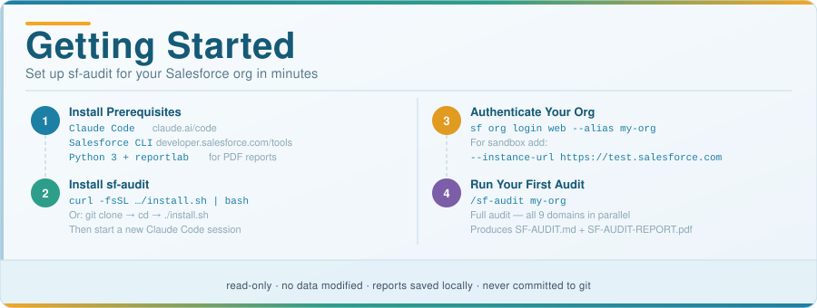

# Getting Started with sf-audit



Everything you need to know before running your first audit.

---

## What This Tool Does

sf-audit connects to your Salesforce org using the Salesforce CLI, runs a series of read-only SOQL and Tooling API queries, and uses Claude AI to score and report on 9 domains of org health. It never modifies any Salesforce data or configuration.

---

## Step 1 — Install the Prerequisites

You need three things installed before running any audit:

### Claude Code

```bash
# Download from:
https://claude.ai/code
```

Verify:
```bash
claude --version
```

### Salesforce CLI

```bash
# Download from:
https://developer.salesforce.com/tools/salesforcecli
```

Verify:
```bash
sf --version
```

### Python 3 + reportlab (for PDF reports only)

```bash
pip3 install reportlab
```

---

## Step 2 — Install sf-audit

```bash
curl -fsSL https://raw.githubusercontent.com/iaesteman/ai-salesforce-audit-claude/main/install.sh | bash
```

Or from a local clone:

```bash
git clone https://github.com/iaesteman/ai-salesforce-audit-claude.git
cd ai-salesforce-audit-claude
./install.sh
```

**After installation, start a new Claude Code session** — skills are only available in sessions started after installing.

---

## Step 3 — Authenticate Your Salesforce Org

```bash
# Production org
sf org login web --alias my-org

# Sandbox
sf org login web --alias my-sandbox --instance-url https://test.salesforce.com
```

Verify the connection:
```bash
sf org display --target-org my-org
```

**Who should run the audit?** The authenticated user needs **API Enabled** and **View Setup and Configuration** on their profile. System Administrator profile gives full coverage.

---

## Step 4 — Run Your First Audit

Open a Claude Code session and type:

```
/sf-audit my-org
```

This runs all 9 audit agents in parallel and produces:
- `SF-AUDIT.md` — full markdown report
- `SF-AUDIT-REPORT.pdf` — client-ready PDF (14 pages)

To run a single domain:
```
/sf-audit-security my-org
/sf-audit-naming my-org
/sf-audit-orphaned my-org
```

---

## Before You Run — Security Checklist

> **Important:** When you run sf-audit, SOQL query results (metadata names, counts, org structure) are processed by Claude AI. This data is sent to Anthropic's servers as part of the Claude Code session. Read the points below before auditing a production org.

| Check | Recommendation |
|:-----:|:---------------|
| **Use a sandbox first** | Run against a sandbox before auditing production — real customer record data is never in scope for metadata audits, but org names and class names still leave your machine |
| **Claude plan** | If using Teams or Enterprise Claude, opt out of data retention in your account settings so conversation data is not used for training |
| **Dedicated audit user** | Create a minimum-permission Salesforce user (API Enabled + View Setup) instead of running as System Administrator |
| **Store reports safely** | Generated `SF-*.md` and `SF-AUDIT-REPORT.pdf` files contain org metadata — keep them out of cloud-synced folders (iCloud, Dropbox, Google Drive) |
| **Delete reports when done** | Run `rm SF-*.md SF-AUDIT-REPORT.pdf` after reviewing — the `.gitignore` already excludes them from source control |
| **Token security** | Salesforce CLI tokens live in `~/.sf/` — ensure that directory has restricted permissions (`chmod 700 ~/.sf`) |

---

## Updating

If you already have sf-audit installed:

```bash
# One-line update
curl -fsSL https://raw.githubusercontent.com/iaesteman/ai-salesforce-audit-claude/main/install.sh | bash

# Or from a local clone
cd ai-salesforce-audit-claude && git pull && ./install.sh
```

Start a new Claude Code session after updating.

---

## All Available Commands

|             Command              |        Output         |                       What It Audits                        |
|:--------------------------------:|:---------------------:|:-----------------------------------------------------------:|
| `/sf-audit [org]`                | `SF-AUDIT.md` + PDF   | Full audit — all 9 domains in parallel                      |
| `/sf-audit-security [org]`       | `SF-SECURITY.md`      | Profiles, perm sets, sharing model, MFA, login activity      |
| `/sf-audit-data [org]`           | `SF-DATA-QUALITY.md`  | Contact/Account/Lead completeness, duplicates, stale records |
| `/sf-audit-automation [org]`     | `SF-AUTOMATION.md`    | Flows, Process Builder, Workflow Rules, Apex triggers         |
| `/sf-audit-architecture [org]`   | `SF-ARCHITECTURE.md`  | Limits, custom objects, Apex API versions, packages          |
| `/sf-audit-coverage [org]`       | `SF-TEST-COVERAGE.md` | Apex test coverage %, classes below 75%, test failures       |
| `/sf-audit-naming [org]`         | `SF-NAMING.md`        | Apex class/trigger/field/flow/validation rule naming         |
| `/sf-audit-orphaned [org]`       | `SF-ORPHANED.md`      | Inactive flows, dead validation/workflow rules, stale fields  |
| `/sf-audit-descriptions [org]`   | `SF-DESCRIPTIONS.md`  | Missing help text on fields, flows, objects, classes         |
| `/sf-audit-field-sprawl [org]`   | `SF-FIELD-SPRAWL.md`  | Objects with 100+ fields, stale fields, duplicate-purpose    |
| `/sf-audit-report-pdf [org]`     | `SF-AUDIT-REPORT.pdf` | Generate PDF from any prior audit data                       |

The `[org]` alias is optional — omit to use your default authenticated org.

---

## Uninstalling

```bash
./uninstall.sh
```

This removes all installed skills, agents, and scripts from `~/.claude/`. Your Salesforce org authentication and any generated reports are not affected.

---

## Need Help?

- **Issues:** [github.com/iaesteman/ai-salesforce-audit-claude/issues](https://github.com/iaesteman/ai-salesforce-audit-claude/issues)
- **Salesforce CLI docs:** [developer.salesforce.com/tools/salesforcecli](https://developer.salesforce.com/tools/salesforcecli)
- **Claude Code:** [claude.ai/code](https://claude.ai/code)