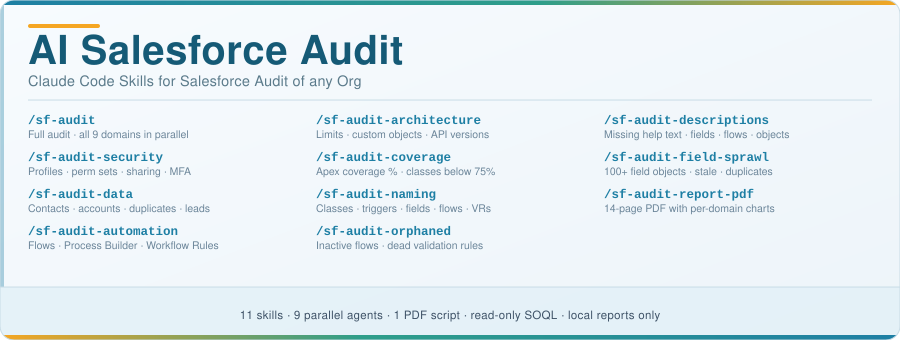

# AI Salesforce Audit with Claude Code



AI-powered Salesforce org health auditing tool for [Claude Code](https://claude.ai/code). Runs 9 parallel AI agents to audit your org across security, data quality, automation health, architecture, and test coverage - producing a scored health report in seconds.

> **New here?** Read [GETTING_STARTED.md](GETTING_STARTED.md) before running any commands — it covers prerequisites, installation, authentication, security recommendations, and all available commands.

---

## Prerequisites

- [Claude Code](https://claude.ai/code) installed
- [Salesforce CLI](https://developer.salesforce.com/tools/salesforcecli) (`sf`) installed
- An authenticated Salesforce org:
  ```bash
  sf org login web --alias my-org
  ```
- *(PDF reports only)* Python 3 + reportlab:
  ```bash
  pip3 install reportlab
  ```

---

## Quick Install

```bash
curl -fsSL https://raw.githubusercontent.com/iaesteman/ai-salesforce-audit-claude/main/install.sh | bash
```

Then start a new Claude Code session.

> **Manual install (alternative):**
> ```bash
> git clone https://github.com/iaesteman/ai-salesforce-audit-claude.git
> cd ai-salesforce-audit-claude
> ./install.sh
> ```

---

## Updating

If you already have the tool installed, re-running the installer updates all skills, agents, and scripts to the latest version:

### Option A — One-line update (remote)

```bash
curl -fsSL https://raw.githubusercontent.com/iaesteman/ai-salesforce-audit-claude/main/install.sh | bash
```

### Option B — From a local clone

```bash
cd ai-salesforce-audit-claude
git pull
./install.sh
```

The installer overwrites existing skill and agent files without removing your org authentication or audit reports. After updating, **start a new Claude Code session** so the updated skills are loaded.

---

## Usage

### Full Org Audit (all 9 domains in parallel)

```
/sf-audit [org-alias]
```

Runs all 9 agents simultaneously and produces a comprehensive `SF-AUDIT.md` plus an auto-generated `SF-AUDIT-REPORT.pdf` with:
- Weighted Org Health Score (0–100) with letter grade
- Executive summary (non-technical)
- Priority Action Matrix (Critical / Important / Strategic)
- Detailed findings for all 9 domains

### Standalone Domain Audits

Run any single domain for a focused, faster report:

|             Command              |        Output         |                       Domain                        |
|:--------------------------------:|:---------------------:|:---------------------------------------------------:|
| `/sf-audit-security [org]`       | `SF-SECURITY.md`      | Profiles, perm sets, sharing model, MFA, login activity |
| `/sf-audit-data [org]`           | `SF-DATA-QUALITY.md`  | Contact/Account/Lead completeness, duplicates, stale records |
| `/sf-audit-automation [org]`     | `SF-AUTOMATION.md`    | Flows, Process Builder, Workflow Rules, Apex triggers |
| `/sf-audit-architecture [org]`   | `SF-ARCHITECTURE.md`  | Limits, custom objects, Apex API versions, packages |
| `/sf-audit-coverage [org]`       | `SF-TEST-COVERAGE.md` | Apex test coverage %, classes below 75%, test failures |
| `/sf-audit-naming [org]`         | `SF-NAMING.md`        | Apex class/trigger/field/flow/validation rule naming |
| `/sf-audit-orphaned [org]`       | `SF-ORPHANED.md`      | Inactive flows, dead validation/workflow rules, stale fields |
| `/sf-audit-descriptions [org]`   | `SF-DESCRIPTIONS.md`  | Missing help text on fields, flows, objects, classes |
| `/sf-audit-field-sprawl [org]`   | `SF-FIELD-SPRAWL.md`  | Objects with 100+ fields, stale fields, duplicate-purpose fields |
| `/sf-audit-report-pdf [org]`     | `SF-AUDIT-REPORT.pdf` | Generate a PDF report from any prior audit data |
| `/sf-audit-all`                  | Terminal summary      | Audit all authenticated orgs + comparison table |

The `[org-alias]` is optional — omit to audit your default authenticated org.

---

## Customising Domain Weights

> **Want to change how domains are weighted in the composite score?** Create a local config file to override any domain weight without editing installed files.
>
> **How to set it up:**
> ```bash
> cp sf-audit-weights-config.md.example sf-audit-weights-config.md
> # Open sf-audit-weights-config.md and adjust the weight values.
> ```
> The skill detects this file automatically at runtime. Weights are normalised so they don't need to sum to 100. Set a weight to `0` to exclude a domain from scoring. See [sf-audit-weights-config.md.example](sf-audit-weights-config.md.example) for examples.

---

## Customising Naming Conventions

> **Want to enforce your own naming standards?** The `/sf-audit-naming` skill supports a local config file that overrides the built-in defaults — no need to edit any installed files.
>
> **How to set it up:**
> ```bash
> cp sf-audit-naming-config.md.example sf-audit-naming-config.md
> # Open sf-audit-naming-config.md and edit the suffixes, patterns, and
> # generic-name lists to match your org's standards.
> ```
> The skill detects this file automatically at runtime. It is excluded from git so it stays local to your project. See [sf-audit-naming-config.md.example](sf-audit-naming-config.md.example) for the full list of configurable options.

---

## What Gets Audited

### Security & Access (20% weight)
- Profiles with dangerous permissions (Modify All Data, View All Data)
- Permission set sprawl and over-permissioned users
- Object-wide default sharing settings
- MFA enforcement status
- IP restrictions and session policies
- Login failure patterns and suspicious activity
- Stale active users (no login in 90+ days)

### Data Quality (15% weight)
- Contact completeness: Email, Phone, Account linkage
- Account completeness: Industry, Type, Phone, BillingCity
- Lead hygiene: Stale open leads, missing email
- Opportunity hygiene: Stale pipeline, overdue close dates
- Active duplicate rules coverage
- Orphaned and unlinked records

### Automation Health (15% weight)
- Active Flows inventory and error analysis
- Process Builder processes (deprecated — migration required)
- Workflow Rules (deprecated — migration required)
- Apex trigger quality: handler pattern, multi-trigger conflicts
- Validation rule documentation quality
- Legacy automation debt score

### Org Architecture (12% weight)
- Governor limit consumption (API calls, data storage, file storage)
- Custom object and field sprawl vs. edition limits
- Apex class API version distribution
- Classes not modified in 2+ years (dead code risk)
- Installed managed packages and license utilization
- Custom Settings vs. Custom Metadata Types usage

### Test Coverage (8% weight)
- Org-wide Apex test coverage percentage
- Classes and triggers below 75% deployment threshold
- Recent test run results and failure analysis
- Test class quality and test-to-production ratio

### Naming Conventions (8% weight)
- Apex class suffix compliance (Controller, Service, Handler, Batch, etc.)
- Trigger naming pattern (`[Object]Trigger`)
- Custom field naming quality (no generic or single-character names)
- Flow and validation rule naming standards

### Orphaned Metadata (8% weight)
- Inactive flows with no active version
- Deactivated validation rules and workflow rules
- Custom fields unmodified for 365+ days

### Description Completeness (7% weight)
- Missing inline help text on custom fields
- Flows and validation rules without descriptions
- Custom objects without descriptions
- Apex classes without doc comments

### Custom Field Sprawl (7% weight)
- Objects with 100+ custom fields (critical)
- Objects with 50–99 custom fields (warning)
- Fields unmodified for 2+ years
- Duplicate-purpose fields on the same object

---

## Scoring

Each domain is scored 0–100, then weighted into a composite Org Health Score:

|  Score  | Grade |                    Label                     |
|:-------:|:-----:|:--------------------------------------------:|
| 90–100  |   A+  |     Excellent — Production-grade org         |
|  80–89  |   A   |   Strong — Minor improvements recommended    |
|  70–79  |   B   |       Good — Some areas need attention       |
|  60–69  |   C   |    Fair — Multiple risk areas identified     |
|  50–59  |   D   |  Poor — Significant remediation required     |
|  < 50   |   F   |      Critical — Immediate action required    |

### Why these weights?

| Domain | Weight | Rationale |
|--------|:------:|-----------|
| Security & Access | 20% | Access control failures have immediate, high-blast-radius impact — a misconfigured profile or overprivileged user can expose all org data |
| Data Quality | 15% | Poor data directly degrades CRM value and every downstream process that depends on it |
| Automation Health | 15% | Broken or deprecated automation (Process Builder, Workflow Rules) causes silent failures and blocks migration to modern Flows |
| Org Architecture | 12% | Governor limit breaches and API version debt create deployment blockers and performance degradation |
| Test Coverage | 8% | Low coverage blocks deployments and masks regressions — important, but only relevant once automation/architecture are stable |
| Naming Conventions | 8% | Inconsistent naming slows onboarding and makes metadata harder to govern at scale |
| Orphaned Metadata | 8% | Dead flows, rules, and fields add cognitive overhead and deployment risk without delivering value |
| Description Completeness | 7% | Missing documentation is a quality signal but rarely causes operational failures |
| Custom Field Sprawl | 7% | High field counts indicate design debt but rarely block operations directly |

> **Custom weights:** Create `sf-audit-weights-config.md` in your project directory to override any domain weight. See `sf-audit-weights-config.md.example` for the template.

---

## Architecture

```
ai-salesforce-audit-claude/
├── sf-audit/SKILL.md                        ← /sf-audit — full parallel audit
├── skills/
│   ├── sf-audit-security/SKILL.md           ← /sf-audit-security
│   ├── sf-audit-data/SKILL.md               ← /sf-audit-data
│   ├── sf-audit-automation/SKILL.md         ← /sf-audit-automation
│   ├── sf-audit-architecture/SKILL.md       ← /sf-audit-architecture
│   ├── sf-audit-coverage/SKILL.md           ← /sf-audit-coverage
│   ├── sf-audit-naming/SKILL.md             ← /sf-audit-naming
│   ├── sf-audit-orphaned/SKILL.md           ← /sf-audit-orphaned
│   ├── sf-audit-descriptions/SKILL.md       ← /sf-audit-descriptions
│   ├── sf-audit-field-sprawl/SKILL.md       ← /sf-audit-field-sprawl
│   ├── sf-audit-report-pdf/SKILL.md         ← /sf-audit-report-pdf
│   └── sf-audit-all/SKILL.md               ← /sf-audit-all (batch)
├── agents/
│   ├── sf-security.md                       ← Security agent
│   ├── sf-data-quality.md                   ← Data quality agent
│   ├── sf-automation.md                     ← Automation agent
│   ├── sf-architecture.md                   ← Architecture agent
│   ├── sf-coverage.md                       ← Test coverage agent
│   ├── sf-naming.md                         ← Naming conventions agent
│   ├── sf-orphaned.md                       ← Orphaned metadata agent
│   ├── sf-descriptions.md                   ← Description completeness agent
│   └── sf-field-sprawl.md                   ← Custom field sprawl agent
├── scripts/
│   └── generate_sf_pdf_report.py            ← PDF generation (requires reportlab)
├── sf-audit-naming-config.md.example        ← Naming convention config template
├── sf-audit-weights-config.md.example      ← Domain weight override template
├── GETTING_STARTED.md                       ← Setup guide for new users
├── NAMING-CONVENTION-GUIDE.md               ← Detailed naming skill guide
├── install.sh
└── uninstall.sh
```

Additional documentation and how-to guides are available in the [GitHub Wiki](https://github.com/iaesteman/ai-salesforce-audit-claude/wiki).

**How it works:**
1. `/sf-audit [org]` runs Phase 1 (discovery) → Phase 2 (dispatches 9 agents in parallel) → Phase 3 (synthesis)
2. Each `/sf-audit-*` command is an independent skill — run any one on its own
3. Each agent queries the live org via `sf` CLI and Tooling API, scores its domain, returns a section
4. Orchestrator combines sections into the final weighted score and writes `SF-AUDIT.md` + `SF-AUDIT-REPORT.pdf`

---

## Uninstall

```bash
./uninstall.sh
```

---

## Data Access & Privacy

This tool queries your Salesforce org using **read-only SOQL and Tooling API calls**. It does not:
- Modify any Salesforce data or configuration
- Store or transmit org data outside your local Claude Code session
- Require system administrator credentials beyond what SOQL/Tooling API access requires

The authenticated user running the audit should have API access and read permissions on the objects being queried (Profiles, PermissionSets, LoginHistory, etc.). System Administrator profile is recommended for full audit coverage.

---

## Limitations

- **MFA enforcement status** cannot always be determined via SOQL — manual verification in Setup > Identity Verification may be required
- **Sharing rules** (beyond OWD settings) require Metadata API access — the audit notes this as a manual review item
- **Field-Level Security** gaps are assessed heuristically — a full FLS audit requires Metadata API retrieval
- **Flow Interview Logs** may not be available in all orgs — requires Flow Debug Logging to be enabled
- **Tooling API** access is required for Apex, Flow, and metadata queries — the authenticated user must have API Enabled on their profile

---

## Contributing

Issues and PRs welcome. When adding new audit checks, follow the agent pattern in `agents/sf-security.md` — each check should include: the SOQL query, the scoring logic, and the output template section.
